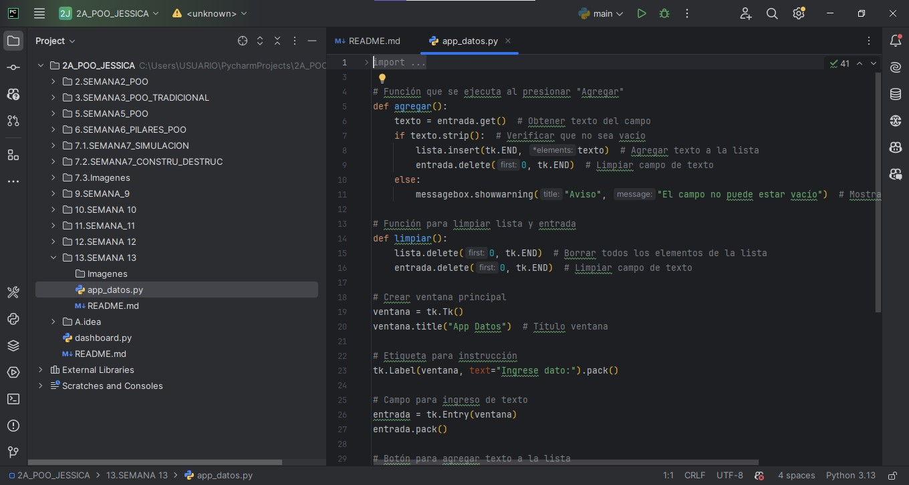
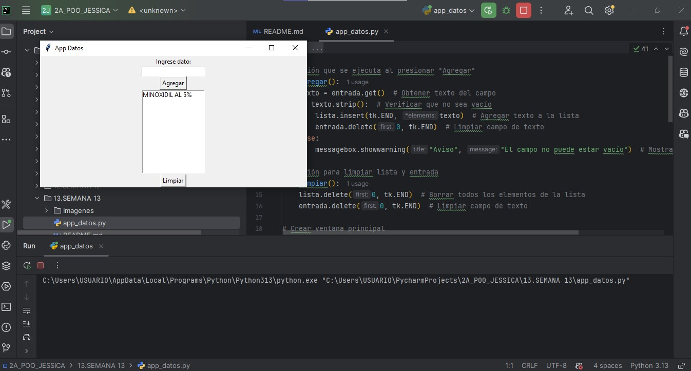
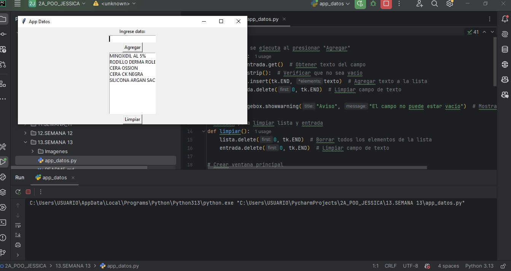
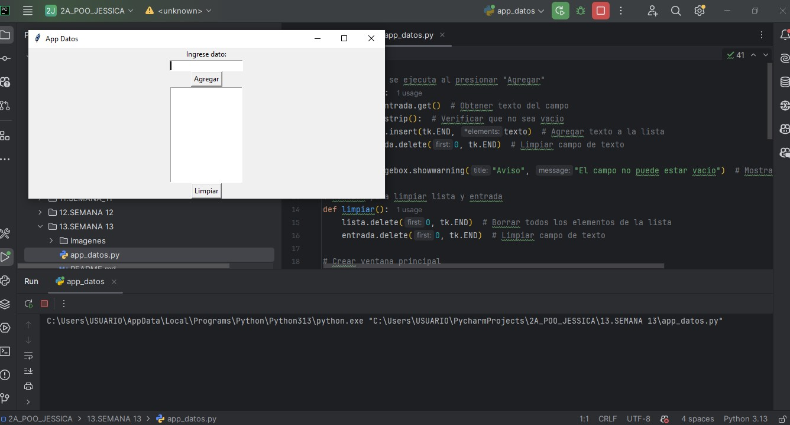
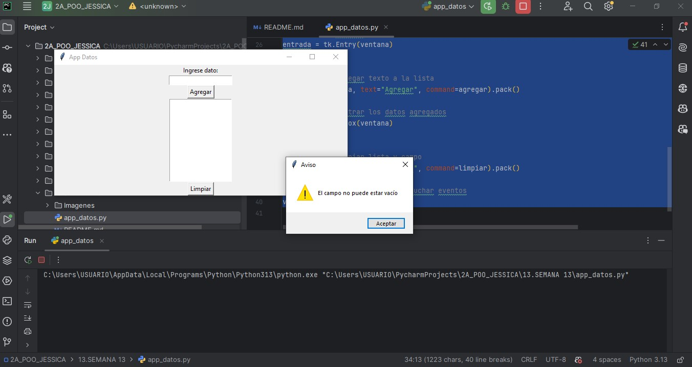

# Universidad Estatal Amazónica

### Facultad de Ingeniería en Tecnologías

### 2do Semestre -  Paralelo "A"  - Programación Orientada a Objetos

---
____

# Aplicación GUI Básica para Gestión de Datos

### Autor: Jessica Pesantez

---

### Descripción

Este proyecto consiste en una aplicación gráfica desarrollada en Python utilizando la librería Tkinter. La aplicación permite al usuario ingresar datos a través de un campo de texto, agregarlos a una lista visible en la interfaz, y limpiar tanto la lista como el campo de entrada mediante botones específicos.

---

### Funcionalidades

- Ingreso de datos mediante campo de texto.
- Agregar datos a una lista visual.
- Validación para evitar entradas vacías.
- Limpieza de la lista y del campo de texto.
- Mensajes de advertencia para entradas inválidas.

---
### Instrucciones para ejecutar

1. Asegúrate de tener Python 3 instalado en tu sistema.

4. Ejecuta el archivo principal con el siguiente comando:
___
___
### Capturas de Pantalla

1. ### Código de la aplicación
Esta imagen muestra el código fuente de una aplicación de escritorio con GUI en Python y la biblioteca Tkinter. Se visualizan las funciones agregar() y limpiar() que manejan la lógica de la aplicación para añadir y borrar datos de una lista.

2. ### GUI con un dato
La interfaz de usuario muestra el resultado de haber agregado un dato llamado "MINOXIDIL AL 5%". El texto ingresado aparece ahora en la lista de la aplicación, confirmando que la funcionalidad de la función agregar() es correcta.

3. ### GUI con varios datos
Aquí se observa la misma GUI con múltiples datos ingresados por el usuario. La lista contiene varios elementos, lo que demuestra que la aplicación puede manejar y mostrar varios datos sucesivamente.

4. ### GUI limpia
Esta imagen muestra la interfaz en su estado inicial o después de ejecutar la función limpiar(). La lista y el campo de entrada están vacíos, listos para que el usuario ingrese nuevos datos, lo que confirma que la función limpiar() opera según lo esperado.

5. ### Advertencia de campo vacío
Esta captura de pantalla muestra una ventana de advertencia de error al intentar agregar datos sin ingresar nada en el campo de texto. El mensaje "El campo no puede estar vacio" indica que el código tiene una validación para evitar entradas vacías.

____

### Tecnologías utilizadas

- Python 3.x
- Tkinter (librería estándar para interfaces gráficas en Python)

---

