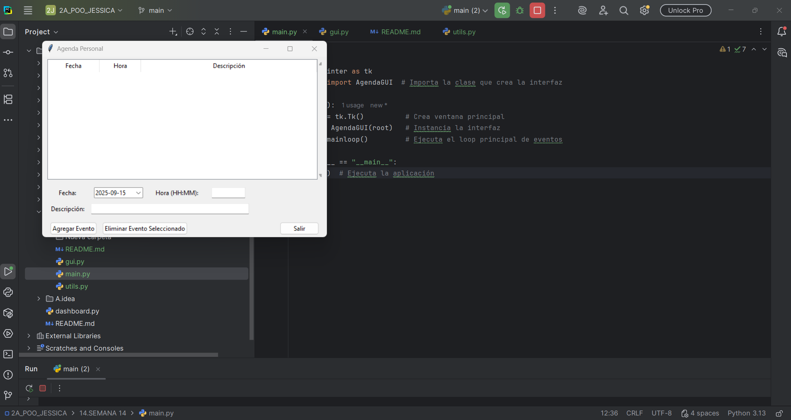
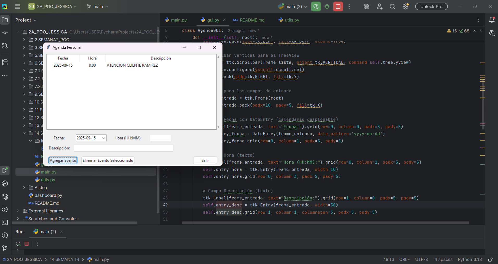
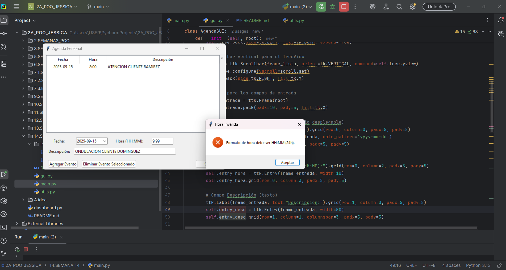
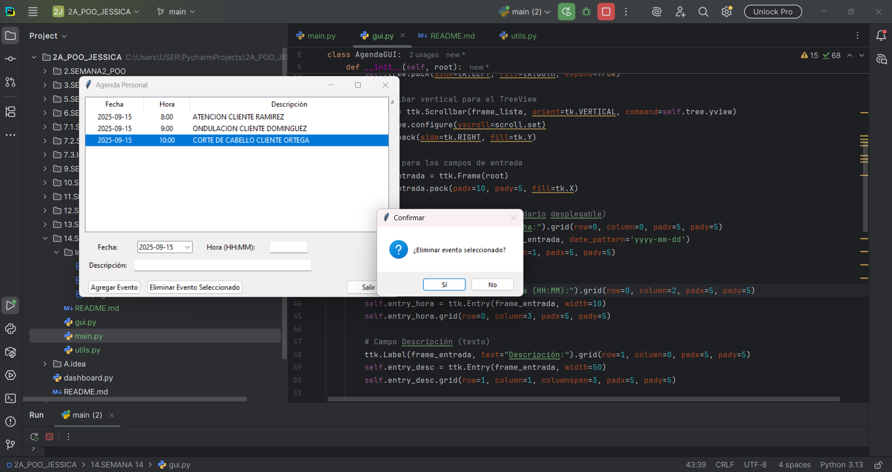
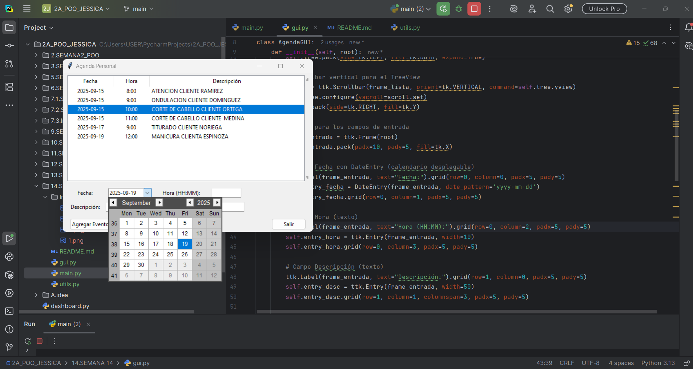
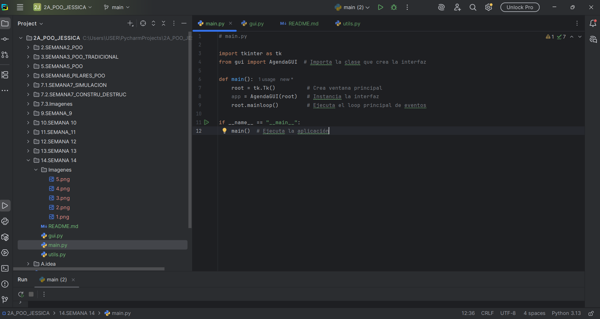

# Agenda Personal - Aplicación GUI en Python con Tkinter

---

## UNIVERSIDAD ESTATAL AMAZONICA  
### 2A DE INGENIERÍA EN TECNOLOGÍAS DE LA INFORMACIÓN  

**Autor:** Jessica Pesantez  

---

## Descripción

Esta aplicación es una agenda personal desarrollada en Python utilizando la biblioteca Tkinter para la interfaz gráfica. Permite al usuario agregar, visualizar y eliminar eventos o tareas programadas con detalles de fecha, hora y descripción.

---

## Características principales

- Interfaz gráfica amigable y organizada con Frames.
- Visualización de eventos en una lista con columnas (Fecha, Hora, Descripción) usando TreeView.
- Entrada de datos con campos para fecha (DateEntry con calendario), hora y descripción.
- Validación del formato de hora (HH:MM en formato 24 horas).
- Confirmación antes de eliminar eventos.
- Botones para agregar eventos, eliminar eventos seleccionados y salir de la aplicación.
- Código modular dividido en archivos para facilitar mantenimiento y escalabilidad.

___

## Capturas de Pantalla

### 1. Captura: Ventana Principal de la Agenda
Descripción:
Muestra la ventana principal de la aplicación al abrirse, con la lista de eventos vacía y los campos de entrada para fecha, hora y descripción visibles, junto con los botones.



### 2. Captura: Agregar un Evento Nuevo
Descripción:
Se muestra el formulario con la fecha seleccionada (usando el DatePicker), la hora y la descripción llenadas, y el evento recién agregado visible en la lista (TreeView).

 

### 3. Captura: Validación de Formato de Hora Inválida
Descripción:
Se muestra un mensaje de error emergente (popup) cuando se intenta agregar un evento con un formato de hora incorrecto (por ejemplo, "25:99"), evidenciando la validación.



### 4. Captura: Eliminar Evento Seleccionado (Confirmación)
Descripción:
Se muestra la ventana de confirmación que aparece al intentar eliminar un evento seleccionado, preguntando si se desea proceder con la eliminación.



### 5. Captura: Lista de Eventos con Múltiples Entradas
Descripción:
Se muestra la lista (TreeView) con varios eventos agregados, evidenciando que la aplicación puede manejar múltiples entradas correctamente.


   
### 6. Captura: Aplicación Cerrada
Descripción:
Muestra la ventana cerrada o el botón "Salir" presionado, evidenciando que la aplicación se cierra correctamente sin errores.




---

## Requisitos

- Python 3.x
- Biblioteca `tkcalendar` (para el selector de fecha)

Instalación de `tkcalendar`:

```bash
pip install tkcalendar