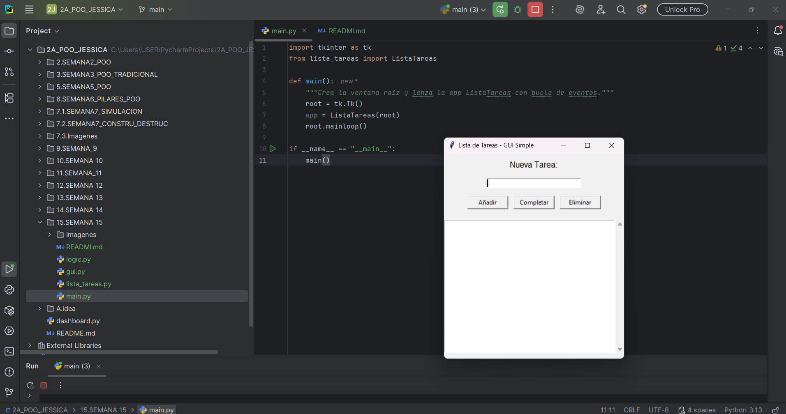
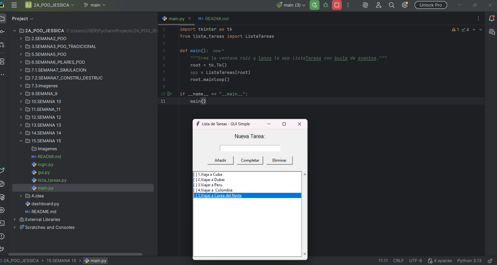
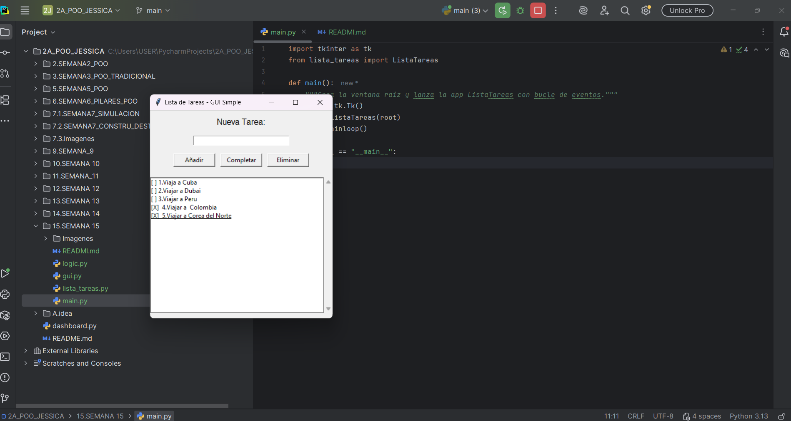
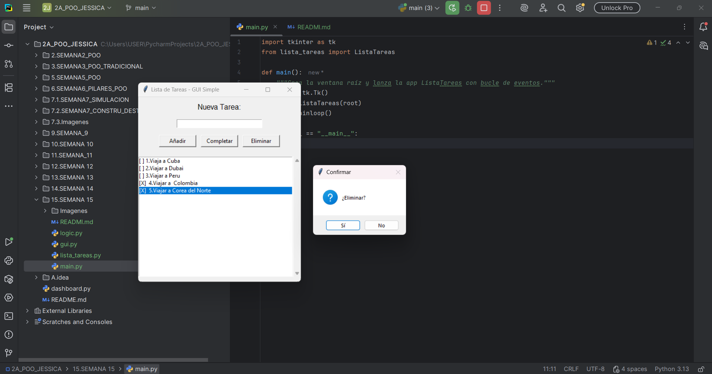

#  Universidad Estatal Amazónica: Lista de Tareas Simple

##  Proyecto de Asignatura: Programación Orientada a Objetos
**Autor:** Jessica Pesantez
**Paralelo:** "A"
**Nivel:** Segundo Semestre de Ingeniería en Tecnologías de la Información

---

##  Descripción del Proyecto

Aplicación de escritorio simple y funcional para la **gestión de tareas**, desarrollada en Python utilizando la librería **Tkinter** para la interfaz gráfica.

El diseño del proyecto aplica principios de la **Programación Orientada a Objetos (POO)** y la **separación de responsabilidades**, dividiendo la aplicación en módulos claros para la Lógica, la Interfaz y el Control.

---

##  Características Principales

* **Añadir Tareas:** Ingresa texto y utiliza el botón **"Añadir"** o la tecla **Enter**.
* **Completar Tareas:** Alterna el estado de la tarea (de `[ ]` a `[X]`) usando el botón **"Completar"**.
* **Doble Clic Rápido:** Permite alternar el estado de una tarea haciendo **doble clic** sobre ella en la lista.
* **Eliminar Tareas:** Remueve una tarea seleccionada con una **ventana de confirmación** para evitar eliminaciones accidentales.

---

##  Estructura del Código

El proyecto está organizado en cuatro módulos principales para una estructura clara:

| Archivo | Rol en la Aplicación | Responsabilidad Principal |
| :--- | :--- | :--- |
| `main.py` | **Punto de Entrada** | Inicia la ventana principal de Tkinter y el bucle de eventos. |
| `lista_tareas.py` | **Controlador/Presentador** | Clase principal que integra la **Lógica** (`TaskManager`) con la **Interfaz** (`gui`). Maneja los *bindings* de eventos (Botones, Enter, Doble Clic). |
| `logic.py` | **Lógica de Negocio (Modelo)** | Contiene la clase `TaskManager`. Gestiona la lista interna de tareas y las operaciones de datos (añadir, alternar estado, eliminar). |
| `gui.py` | **Interfaz de Usuario (Vista)** | Define la función `setup_ui` que construye y organiza todos los *widgets* visuales de Tkinter (Entry, Listbox, Botones). |

---

##  Capturas de Pantalla

**Nota:** Asegúrate de reemplazar los marcadores de posición (`[Image...]`) con las imágenes reales de tu aplicación.

### Captura 1: Aplicación Inicial y Añadir Tarea
**Descripción:** Muestra la ventana de la aplicación (**GUI Completa**) en su estado inicial. Esto ilustra la **disponibilidad inmediata** del campo de entrada y el botón **Añadir** para empezar a crear la lista de tareas.

### Captura 2: Tareas Múltiples y Toggle de Estado
**Descripción:** Muestra varias tareas en la lista, con al menos una marcada como **completada** (`[X]`). Esto demuestra la correcta **actualización del estado visual** de la tarea.

### Captura 3: Confirmación de Eliminación de Tarea
**Descripción:** Muestra el cuadro de diálogo de **confirmación** que se activa antes de que la tarea sea eliminada. Esto asegura que el proceso de **borrado de datos** sea seguro para el usuario.

